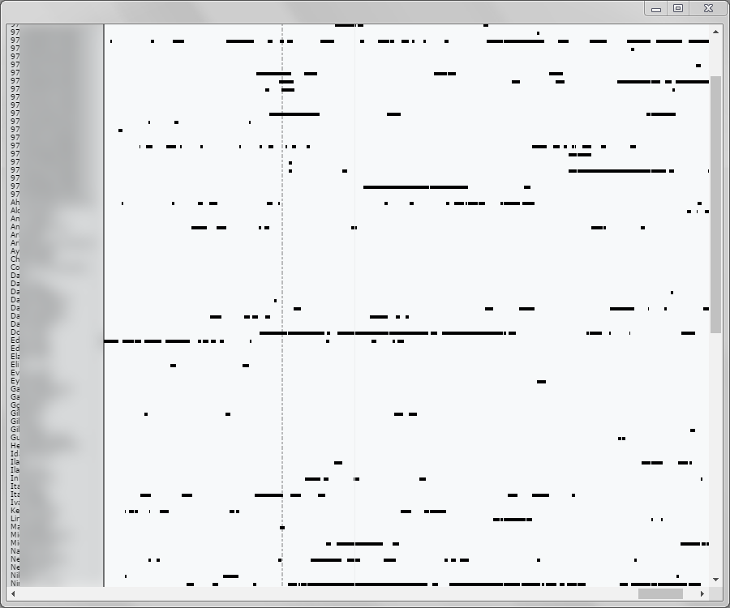

#  WaTracker

__NOTE:__ Google [announced](https://blog.chromium.org/2016/08/from-chrome-apps-to-web.html)
that Chrome Apps will stop working in early 2018.
This project may someday be rewritten as a Chrome Extension, but until the it will not be updated.

WaTracker is a Chrome app that hooks into the WhatsApp web app at [web.whatsapp.com](https://web.whatsapp.com/)
to repeatedly check if your friends are online.
This information is collected and stored locally on your computer,
so you can later visualize it and analyze your friends' activity.
You can find out how much time they spend using WhatsApp,
and if they use it a lot you can also know when they go to sleep or wake up!

## Installation

Open `chrome://extensions/`, enable the "Developer mode" checkbox at the top of the page,
press "Load unpacked extension..." and select the folder with this app.
Now you can open WaTracker just like a regular program.
(If you're on Windows, search for it in the Start Menu)

## How It Came to Be

A long time ago I had the idea of manually writing down the WhatsApp "last seen" times
of someone throughout the day to find out how much time they spend using WhatsApp.
While I never got bored enough to actually do this,
some time later I learned about [web.whatsapp.com](https://web.whatsapp.com/) - a web app that
lets you use WhatsApp from your browser, as long as your phone is connected to the Internet.
"If some Javascript code on a page is getting the needed information,
then surely I can get it too and track all my friends at once!", I thought.

The first attempt to gain the data by MITM-ing the WebSocket
that the page used to communicate with its server was unsuccessful,
as some of the relevant communications were encrypted.
After wasting a lot of time exploring this direction, I finally found that many of WhatsApp's functions were in
`window.Store`, just waiting for me to call them.
I managed to get the presence information by subscribing to presence updates for each of the contacts
and checking if they are online every second.

To make stalking your friends a pleasant experience, WaTracker is built as a Chrome App with multiple windows:
- The "record" window asks you to sign into a webview of [web.whatsapp.com](https://web.whatsapp.com/)
so it can inject content scripts into the page and gather the presence information.
- The "online" window shows which of your friends are currently online. (Works only if you are recording)
- The "timeline" window packs all of the activity data you recorded into one big timeline graph.
(It uses the [D3](https://d3js.org/) library to create the graph in SVG)
- The "launcher" windows is the first to open, and from there you can open the other windows.

The timeline graphs turned out to be very interesting and at times quite surprising.
Some people who I was sure spent most of their day using WhatsApp were actually moderate users,
while others whom I didn't even suspect spent frightening amounts of time texting, sometimes late at night.

## Security Implications

While it sure is creepy, it's unclear whether this is a security vulnerability or not. The online indicator is one of the core
features of WhatsApp and me being a creep about it doesn't warrant a fix. I could stalk people on the street as well :)

WhatsApp may add an option to disable the online indicator or throttle requests for status of multiple people.

## Known Issues

Whenever my phone can't find any Wi-Fi network and begins using mobile internet,
the WhatsApp web app will claim it can't connect to the phone, and so the recording will stop.

## Future Work

WhatsApp has a "typing..." indicator. We could poll it to detect when someones starts typing a message
and immediatly send him a "What are you typing?" message every time.

## License

WaTracker is MIT licensed.
See the attached LICENSE.txt file for more information.
